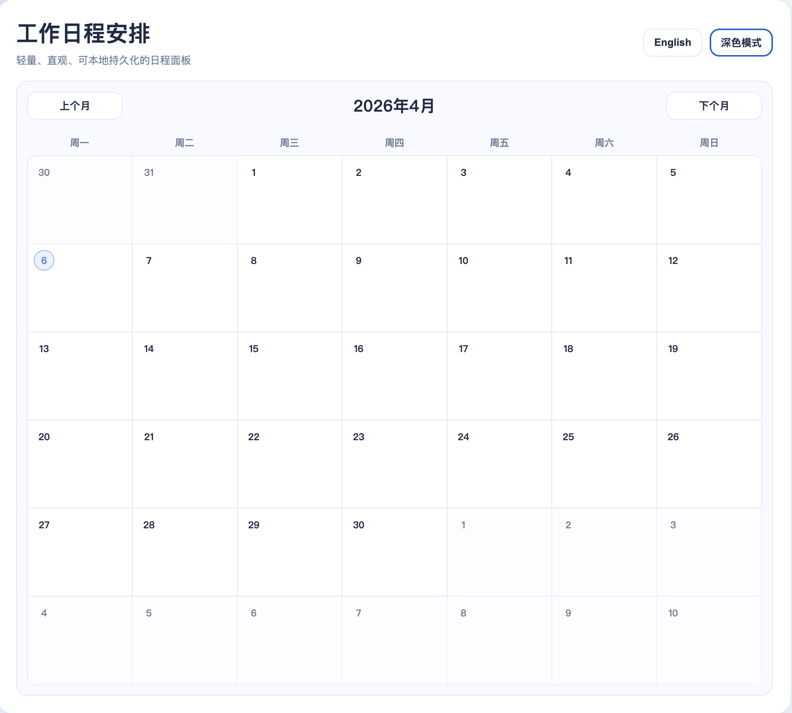
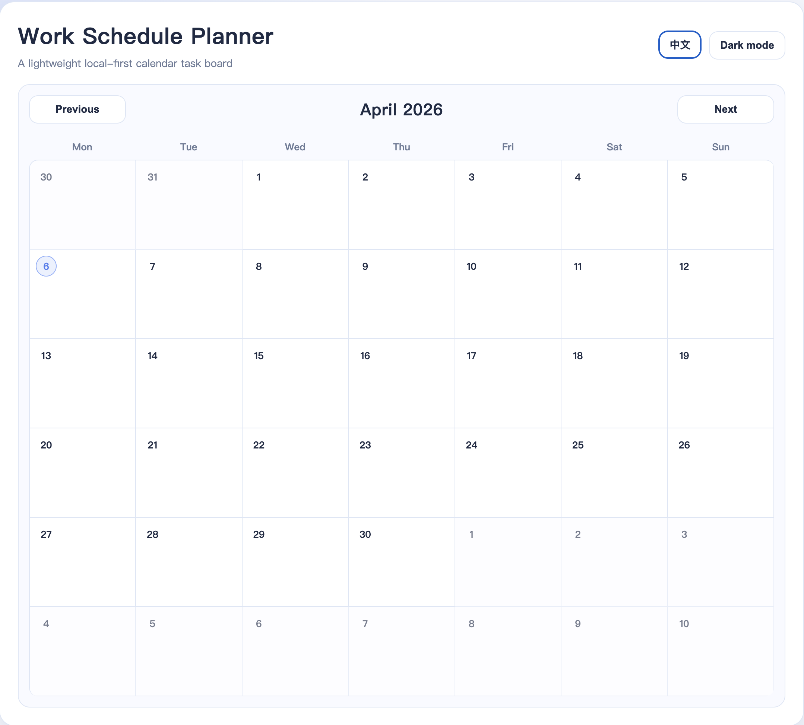
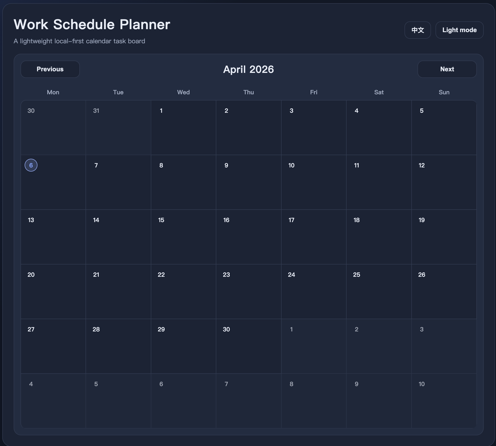
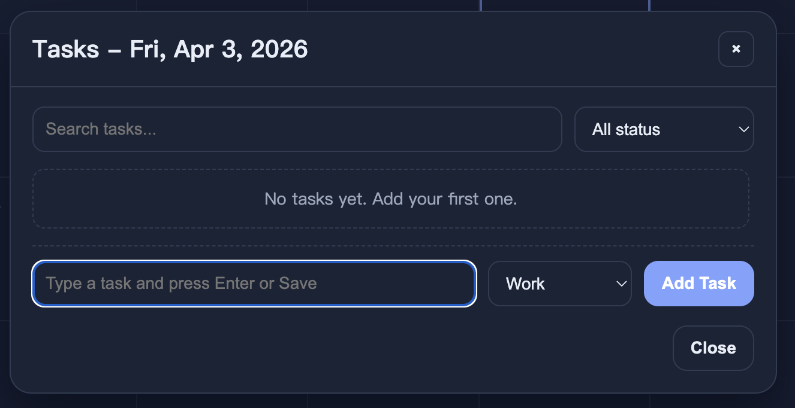

# 📅 Work Schedule Planner

A polished, browser-based calendar task planner built with **vanilla HTML, CSS, and JavaScript**.  
Designed as a **portfolio-ready frontend project** with clean UI, practical features, and zero setup.

---

## 🔗 Live Demo

[Open the live demo](https://noah-art-eng.github.io/Schedule-app/)

---

## 🖼️ Preview

---

## ✨ Highlights

- Clean and modern **calendar-based UI**
- Interactive **task management workflow**
- **Persistent storage** with `localStorage`
- Built with **pure JavaScript** and no frameworks
- Lightweight, fast, and easy to run locally

---

## 📌 Project Overview

Work Schedule Planner is a **local-first monthly calendar app** for managing day-level tasks.

It focuses on:

- usability and simplicity
- clean visual presentation
- structured frontend logic
- dependency-free architecture

---

## Features

- Monthly calendar view (7×6 grid) with previous / next month navigation
- Click any date to open a task panel
- Add, complete, edit, and delete tasks
- Search tasks and filter by status
- Task categories: **Work / Study / Life**
- Built-in **Dark mode**
- Built-in **Chinese / English** language switch
- Persistent local data storage via `localStorage`

---

## Usage

- Click a date cell to open the task panel
- Type a task and press **Enter** or click **Add Task**
- Mark tasks as done or todo
- Use search and status filters to manage tasks more easily
- Switch theme and language from the top-right controls

---

## Tech Stack

- **HTML5** — semantic page structure
- **CSS3** — layout, theming, responsive UI, and visual polish
- **Vanilla JavaScript** — state management, DOM rendering, and i18n logic
- **localStorage** — client-side persistence

---

## Project Structure

- `schedule.html` — main application file
- `README.md` — project documentation
- `1.png / 2.png / 3.png / 4.png` — project screenshots

---

## How to Run

1. Clone or download this repository
2. Open `schedule.html` directly in your browser
3. Click any date to start managing tasks

No dependencies, no build tools, and no backend required.

---

## 💡 Why This Project

This project was built as a **frontend portfolio piece** to demonstrate:

- UI layout and visual hierarchy
- interactive task management design
- browser-side state handling without frameworks
- practical product thinking in a lightweight app

---

## Future Improvements

- Drag-and-drop task ordering
- Weekly / list view switch
- Import / export task data
- Browser notification reminders
- Basic productivity analytics

---
